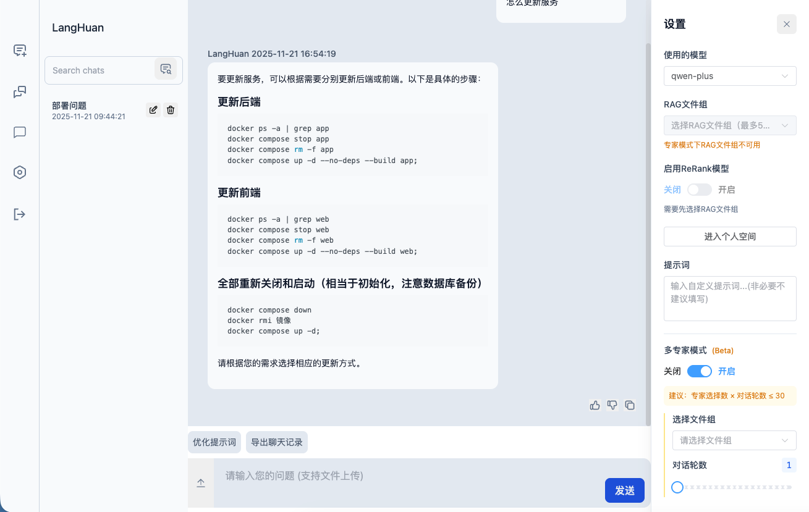
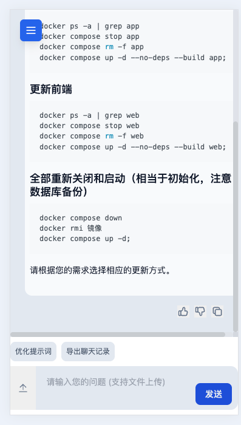
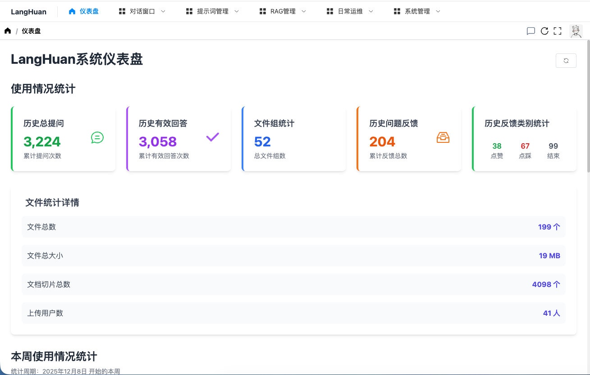
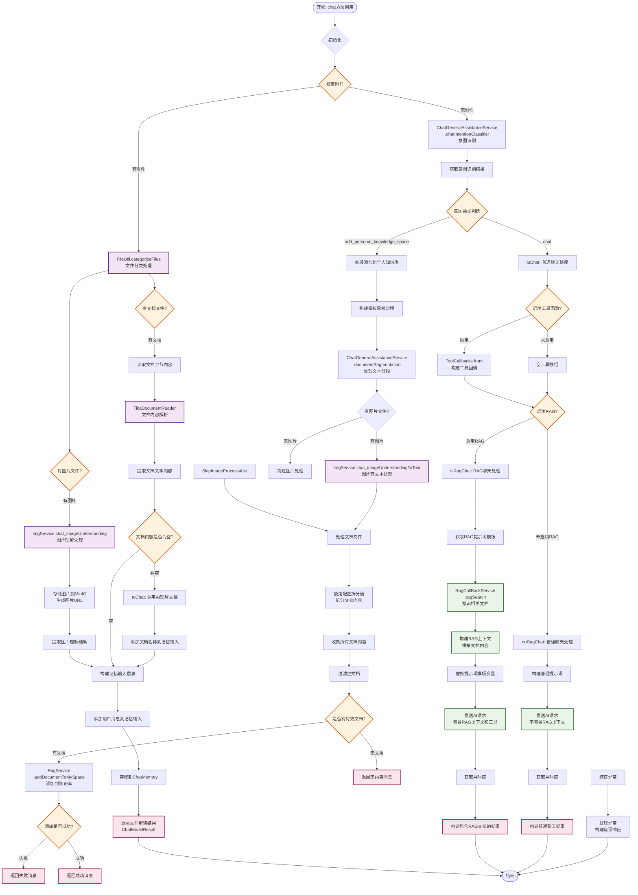
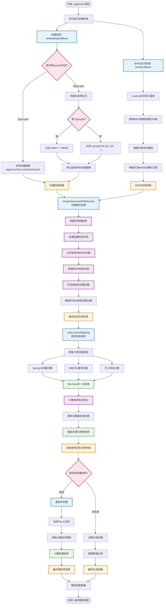

# LangHuan(万卷琅嬛)

LangHuan 是一个基于 Kotlin + Spring AI 的智能对话与知识检索系统，集成了 RAG 技术，为个人和小团队提供知识管理和智能问答的一站式解决方案。

`琅嬛福地，藏天下典籍。`

## 功能特色

### 🤖 智能对话系统
- **个人知识空间**：为每个用户提供独立的知识库管理空间
- **对话记忆功能**：智能保存和管理对话上下文，提供连贯的交互体验
- **深度思考模式**：支持模型深度推理输出，提供更详细的分析过程
- **图片文档识别**：支持多模态模型，可识别图片和文档，提供更丰富的答案和体验
- **多专家模式对话**：支持多角色协作对话，模拟专家团队讨论
- **移动端适配**：响应式布局设计，自适应手机/平板等设备，移动端友好的界面交互

### 📚 RAG知识检索
- **智能文档处理**：自动提取文档图片并进行存储，提供图文并茂的答案
- **混合检索技术**：结合向量检索、BM25全文检索、分数融合和重排序
- **重排序机制**：支持ReRank模型，优化检索结果排序
- **多格式文档支持**：支持Md、Word、HTML、纯文本等多种文档格式
- **召回测试工具**：提供可视化的检索效果测试和优化工具

### 🗂️ 文件管理系统
- **文件组织管理**：支持文件分组、标签化管理
- **权限控制**：细粒度的文件访问权限控制，支持公开/私有设置
- **文件共享**：支持用户间文件组共享，便于协作
- **向量化管理**：支持单条向量的编辑、删除和优化
- **批量导入导出**：支持RAG文档的批量导入导出功能

### 👥 用户权限系统
- **角色权限管理**：接口级别，完整的RBAC权限控制体系
- **JWT认证**：安全的用户认证和授权机制
- **权限缓存优化**：高效的权限验证和缓存机制
- **多用户支持**：支持多用户并发使用，数据隔离

### 🔧 系统管理功能
- **提示词管理**：可配置的提示词模板和优化工具
- **模型配置**：支持多种OpenAI兼容模型的配置和切换
- **消息通知系统**：完整的系统消息推送和通知机制
- **使用统计仪表盘**：详细的系统使用情况统计和分析
- **MinIO对象存储**：集成对象存储，知识文件定期备份等功能

### 🐳 部署运维
- **轻量化部署**：适合个人和小团队快速部署使用
- **Docker容器化**：可选的完整的Docker部署方案
- **数据库备份**：自动化的数据备份和恢复机制
- **定时任务管理**：定时清理临时文件等维护任务
- **日志管理**：完善的系统日志记录和管理

## 部署

### 推荐使用
 [Docker部署方案](./langhuan_docker_dist/README.md)
### 基于源码部署：
 [前端本地部署](./langhuan-web/README.md) |  [后端本地部署](./langhuan-server/README.md) 

## 部分功能截图

## 重点功能流程(可能更新不及时)
### 对话流程

### 检索流程

## 功能发展历程

### 核心功能建设期 (2024.12 - 2025.01)
- [x] 基础对话功能和记忆机制 (2024.12)
- [x] RAG检索问答系统 (2024.12)
- [x] 函数调用功能实现 (2024.12)
- [x] JWT用户认证授权 (2024.12)
- [x] 前端工程页面开发 (2024.12)
- [x] 用户角色权限体系 (2024.12)
- [x] 聊天记录管理 (2024.12)
- [x] OpenAI兼容模型接入 (2025.01)

### 功能扩展期 (2025.02 - 2025.03)
- [x] Spring AI框架升级优化 (2025.03)
- [x] 提示词配置管理 (2025.03)
- [x] 文件组和文件管理 (2025.03)
- [x] RAG召回测试工具 (2025.03)
- [x] Docker部署方案 (2025.03)

### 体验优化期 (2025.04 - 2025.05)
- [x] 提示词优化功能 (2025.03)
- [x] 文字向量化管理 (2025.04)
- [x] ReRank重排序机制 (2025.04)
- [x] Markdown格式支持 (2025.04)
- [x] 大文档处理优化 (2025.04)
- [x] 文档引用和反馈 (2025.04-05)
- [x] Spring AI 1.0正式版 (2025.05)
- [x] 权限控制完善 (2025.05)
- [x] RAG文件导出功能 (2025.05)

### 功能完善期 (2025.06 - 2025.08)
- [x] ReRank模型集成 (2025.06)
- [x] 深度思考模式 (2025.06)
- [x] 消息通知系统 (2025.06)
- [x] 权重计算优化 (2025.07)
- [x] 仪表盘统计功能 (2025.07)
- [x] 用户信息完善 (2025.07)
- [x] 文件组权限共享 (2025.07)
- [x] MinIO对象存储 (2025.08)
- [x] 多专家模式对话 (2025.08)
- [x] 个人知识空间 (2025.08)
- [x] 新增图片和文档的多模态识别 (2025.08)
- [x] 混合检索技术 (2025.10)
- [x] 移动端适配，更多的使用细节处理 (2025.12)

### 规划中功能
- [ ] 移除funcation tool代码，转为全面对MCP的支持，实现MCP热插拔
- [ ] 计划开发与之配合的MCP服务
- [ ] 提供针对模型等信息的配置页面，可自由更换模型api，rag配置，权重等
- [ ] 添加更多的拆分文档方式（在全文中划线拆分chunk）
- [ ] 不满意的回答过滤文档后重新回答
- [ ] 在对话中标记文档，记录被调用次数多并且满意的文档，区分高低价值 便于维护
- [ ] 支持调用更多的服务解析文档

## 开源协议

本项目采用 **Apache License 2.0** 许可协议，详情见 `LICENSE` 文件。使用前请务必遵守协议条款。

## 特别声明

1. 作者不对因使用本项目代码引发的任何法律风险或技术问题承担责任。
2. 本项目与作者任职单位（如有）无关，非职务作品，未利用雇主资源、技术文档或商业信息。

## 联系与支持

如有问题，请联系开发团队或提交 Issue。
