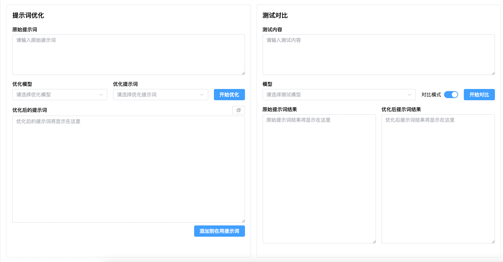
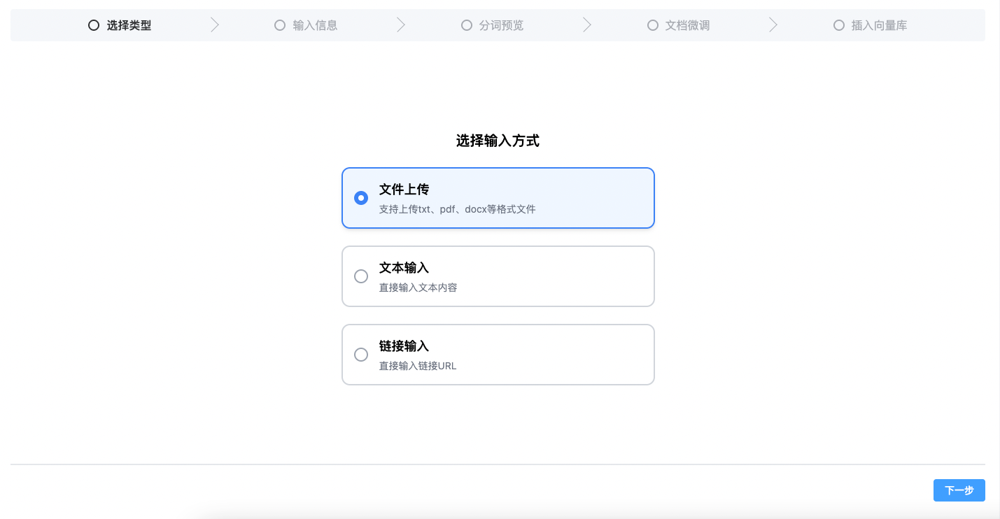
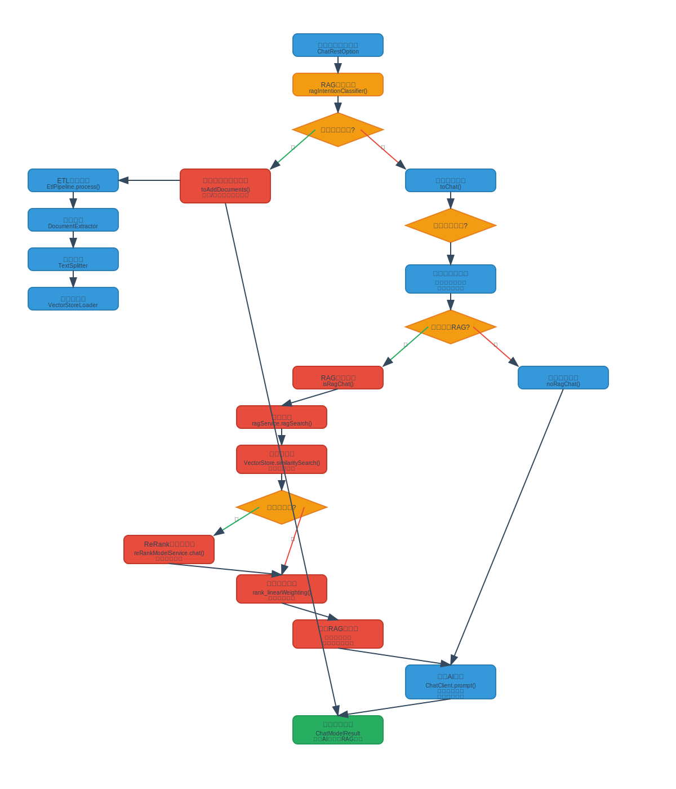

# LangHuan(万卷琅嬛)

`琅嬛福地，藏天下典籍。`

### 功能特色

#### 🤖 智能对话系统
- **多专家模式对话**：支持多角色协作对话，模拟专家团队讨论
- **个人知识空间**：为每个用户提供独立的知识库管理空间
- **对话记忆功能**：智能保存和管理对话上下文，提供连贯的交互体验
- **深度思考模式**：支持模型深度推理输出，提供更详细的分析过程
- **图片识别**：支持多模态模型，可配合rag识别图片，提供更丰富的答案和体验

#### 📚 RAG知识检索
- **重排序机制**：支持ReRank模型，优化检索结果排序
- **多格式文档支持**：支持PDF、Word、HTML、纯文本等多种文档格式
- **智能文档处理**：自动提取文档图片并进行存储
- **召回测试工具**：提供可视化的检索效果测试和优化工具
- **混合检索技术（待做）**：结合向量检索和关键词检索，提升召回准确率

#### 🗂️ 文件管理系统
- **文件组织管理**：支持文件分组、标签化管理
- **权限控制**：细粒度的文件访问权限控制，支持公开/私有设置
- **文件共享**：支持用户间文件组共享，便于协作
- **向量化管理**：支持单条向量的编辑、删除和优化
- **批量导入导出**：支持RAG文档的批量导入导出功能

#### 👥 用户权限系统
- **角色权限管理**：完整的RBAC权限控制体系
- **JWT认证**：安全的用户认证和授权机制
- **权限缓存优化**：高效的权限验证和缓存机制
- **多用户支持**：支持多用户并发使用，数据隔离

#### 🔧 系统管理功能
- **提示词管理**：可配置的提示词模板和优化工具
- **模型配置**：支持多种OpenAI兼容模型的配置和切换
- **消息通知系统**：完整的系统消息推送和通知机制
- **使用统计仪表盘**：详细的系统使用情况统计和分析
- **MinIO对象存储**：集成对象存储，支持大文件管理

#### 🐳 部署运维
- **Docker容器化**：完整的Docker部署方案
- **数据库备份**：自动化的数据备份和恢复机制
- **定时任务管理**：支持定时清理临时文件等维护任务
- **日志管理**：完善的系统日志记录和管理

### 部分功能截图

#### 对话页面

#### 后台仪表盘

#### 提示词优化

#### 添加向量

### 当前对话流程

### 部署

请见langhuan_docker_dist/README.md

### 功能发展历程

#### 核心功能建设期 (2024.12 - 2025.01)
- [x] 基础对话功能和记忆机制 (2024.12)
- [x] RAG检索问答系统 (2024.12)
- [x] 函数调用功能实现 (2024.12)
- [x] JWT用户认证授权 (2024.12)
- [x] 前端工程页面开发 (2024.12)
- [x] 用户角色权限体系 (2024.12)
- [x] 聊天记录管理 (2024.12)
- [x] OpenAI兼容模型接入 (2025.01)

#### 功能扩展期 (2025.02 - 2025.03)
- [x] Spring AI框架升级优化 (2025.03)
- [x] 提示词配置管理 (2025.03)
- [x] 文件组和文件管理 (2025.03)
- [x] RAG召回测试工具 (2025.03)
- [x] Docker部署方案 (2025.03)

#### 体验优化期 (2025.04 - 2025.05)
- [x] 提示词优化功能 (2025.03)
- [x] 文字向量化管理 (2025.04)
- [x] ReRank重排序机制 (2025.04)
- [x] Markdown格式支持 (2025.04)
- [x] 大文档处理优化 (2025.04)
- [x] 文档引用和反馈 (2025.04-05)
- [x] Spring AI 1.0正式版 (2025.05)
- [x] 权限控制完善 (2025.05)
- [x] RAG文件导出功能 (2025.05)

#### 功能完善期 (2025.06 - 2025.08)
- [x] ReRank模型集成 (2025.06)
- [x] 深度思考模式 (2025.06)
- [x] 消息通知系统 (2025.06)
- [x] 权重计算优化 (2025.07)
- [x] 仪表盘统计功能 (2025.07)
- [x] 用户信息完善 (2025.07)
- [x] 文件组权限共享 (2025.07)
- [x] MinIO对象存储 (2025.08)
- [x] 多专家模式对话 (2025.08)
- [x] 个人知识空间 (2025.08)

#### 规划中功能
- [ ] 混合检索技术

### 开源协议

本项目采用 **Apache License 2.0** 许可协议，详情见 `LICENSE` 文件。使用前请务必遵守协议条款。

### 特别声明

1. 作者不对因使用本项目代码引发的任何法律风险或技术问题承担责任。
2. 本项目与作者任职单位（如有）无关，非职务作品，未利用雇主资源、技术文档或商业信息。

---
**版权所有 © liShuangQ [年份（如2024-～）]**  
本项目为 **个人独立开发作品**，版权归作者所有。
