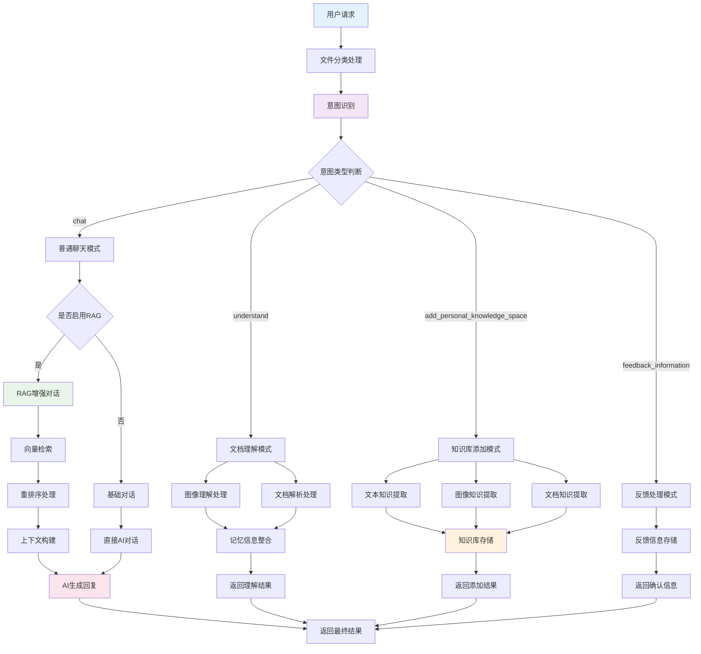
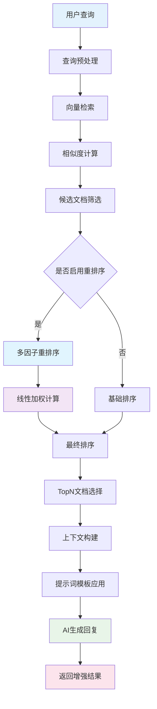
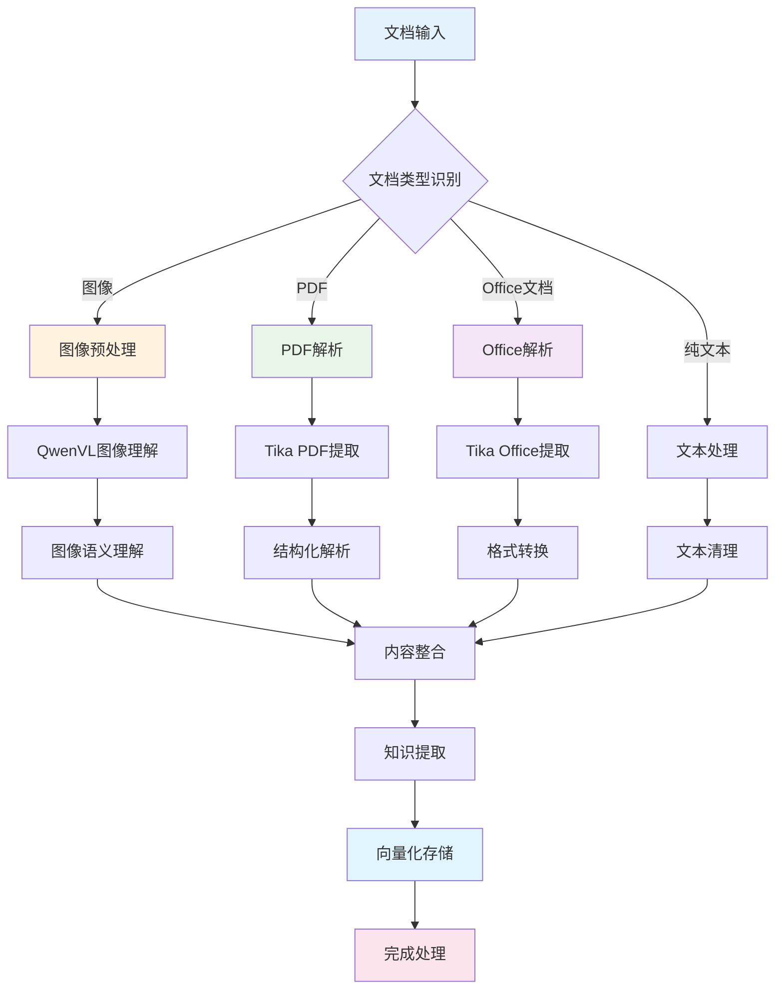
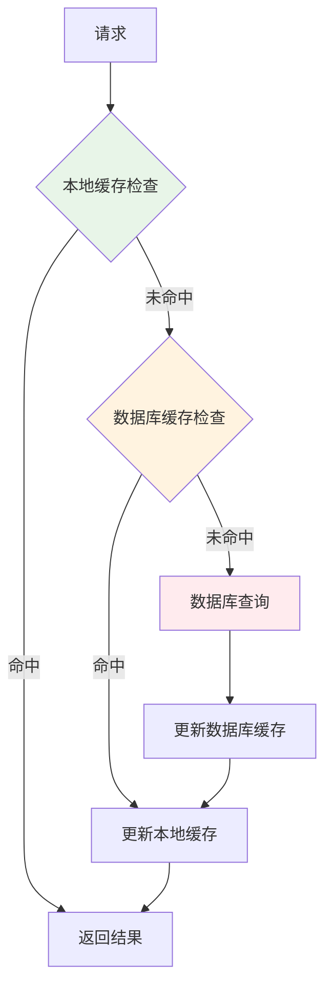
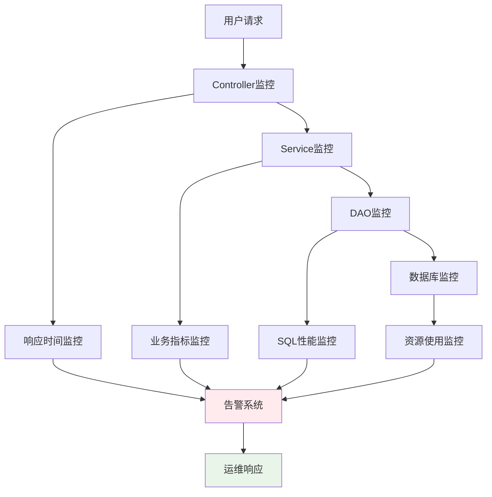

# LangHuan AI智能对话系统技术架构与实现

## 🎯 项目概述

LangHuan AI智能对话系统是一个基于Spring Boot 3.x + Spring AI框架构建的单体应用智能对话平台，集成了先进的RAG（检索增强生成）技术、多模态文档理解、智能意图识别和工具函数调用等核心功能。系统采用分层架构设计，具备高可扩展性、高可用性和企业级安全保障。

## 🏗️ 系统架构设计

### 核心技术栈

- **后端框架**: Spring Boot 3.x + Spring AI
- **AI模型**: OpenAI GPT系列 + QwenVL图像理解模型
- **向量数据库**: PostgreSQL + pgvector扩展
- **文档处理**: Apache Tika + 自研文档解析引擎
- **对象存储**: MinIO分布式存储
- **数据库**: PostgreSQL 14+
- **构建工具**: Maven 3.8+
- **缓存**: 本地缓存 + 数据库缓存

### 完整系统架构图

```
┌─────────────────────────────────────────────────────────────────────────────────┐
│                              前端应用层                                          │
│                         (Web界面 + API客户端)                                    │
└─────────────────────────────────────────────────────────────────────────────────┘
                                        │
                                        ▼
┌─────────────────────────────────────────────────────────────────────────────────┐
│                              控制器层 (Controller)                               │
│  ┌─────────────┐ ┌─────────────┐ ┌─────────────┐ ┌─────────────┐ ┌─────────┐    │
│  │    Chat     │ │    Rag      │ │    User     │ │    File     │ │  其他   │     │
│  │  对话管理    │ │  RAG管理     │ │  用户管理    │ │  文件管理     │ │ 控制器  │     │
│  └─────────────┘ └─────────────┘ └─────────────┘ └─────────────┘ └─────────┘    │
└─────────────────────────────────────────────────────────────────────────────────┘
                                        │
                                        ▼
┌─────────────────────────────────────────────────────────────────────────────────┐
│                              业务服务层 (Service)                                 │
│                                                                                 │
│  ┌─────────────────────────────────────────────────────────────────────────────┐ │
│  │                        AI智能服务层                                           │ │
│  │  ┌─────────────┐ ┌─────────────┐ ┌─────────────┐ ┌─────────────┐            │ │
│  │  │ ChatService │ │ RagService  │ │ ImgService  │ │ChatGeneral  │            │ │
│  │  │  智能对话    │ │  RAG检索    │ │  图像理解    │ │AssistanceSvc│             │ │
│  │  └─────────────┘ └─────────────┘ └─────────────┘ └─────────────┘            │ │
│  │  ┌─────────────┐                                                            │ │
│  │  │ChatMemorySvc│                                                            │ │
│  │  │  记忆管理    │                                                            │ │
│  │  └─────────────┘                                                            │ │
│  └─────────────────────────────────────────────────────────────────────────────┘ │
│                                                                                 │
│  ┌─────────────────────────────────────────────────────────────────────────────┐ │
│  │                        业务管理服务层                                       │ │
│  │  ┌─────────────┐ ┌─────────────┐ ┌─────────────┐ ┌─────────────┐           │ │
│  │  │ TUserService│ │TRagFileSvc  │ │TPromptsSvc  │ │Notifications│           │ │
│  │  │  用户管理    │ │  文件管理    │ │  提示词管理  │ │ 通知管理服务 │           │ │
│  │  └─────────────┘ └─────────────┘ └─────────────┘ └─────────────┘           │ │
│  │  ┌─────────────┐ ┌─────────────┐ ┌─────────────┐ ┌─────────────┐           │ │
│  │  │ TRoleService│ │TPermission  │ │TFileUrlSvc  │ │MinioService │           │ │
│  │  │  角色管理    │ │  权限管理     │ │ 文件URL管理  │ │ 对象存储服务  │           │ │
│  │  └─────────────┘ └─────────────┘ └─────────────┘ └─────────────┘           │ │
│  └─────────────────────────────────────────────────────────────────────────────┘ │
└─────────────────────────────────────────────────────────────────────────────────┘
                                        │
                                        ▼
┌─────────────────────────────────────────────────────────────────────────────────┐
│                              工具 utils层                                       │
│  ┌─────────────────┐ ┌─────────────────┐ ┌─────────────────┐ ┌─────────────┐   │
│  │   RAG工具链      │ │   图像处理工具    │ │   HTTP工具      │ │   其他工具   │   │
│  │EtlPipeline+Split│ │ImageUnderstanding│ │GetRequestUtils │ │SecurityUtils│   │
│  │DocumentExtractor│ │   Processor     │ │PostRequestUtils │ │  FileUtil   │   │
│  └─────────────────┘ └─────────────────┘ └─────────────────┘ └─────────────┘   │
└─────────────────────────────────────────────────────────────────────────────────┘
                                        │
                                        ▼
┌─────────────────────────────────────────────────────────────────────────────────┐
│                              数据访问层 (DAO/Mapper)                            │
│  ┌─────────────┐ ┌─────────────┐ ┌─────────────┐ ┌─────────────┐           │
│  │ MyBatis-Plus│ │ VectorStore │ │JdbcTemplate │ │  自定义DAO   │           │
│  │  ORM框架     │ │  向量存储    │ │  原生SQL     │ │   实现      │           │
│  └─────────────┘ └─────────────┘ └─────────────┘ └─────────────┘           │
└─────────────────────────────────────────────────────────────────────────────────┘
                                        │
                                        ▼
┌─────────────────────────────────────────────────────────────────────────────────┐
│                              数据存储层                                         │
│  ┌─────────────────────────────────────────────────────────────────────────────┐ │
│  │                          PostgreSQL 数据库                                 │ │
│  │  ┌─────────────┐ ┌─────────────┐ ┌─────────────┐ ┌─────────────┐           │ │
│  │  │   业务数据   │ │  向量数据     │ │   用户数据    │ │  配置数据    │           │ │
│  │  │ (用户/角色/  │ │(pgvector扩展)│ │ (权限/会话)   │ │ (提示词/日志)│           │ │
│  │  │  文件/反馈)  │ │             │ │              │ │             │           │ │
│  │  └─────────────┘ └─────────────┘ └─────────────┘ └─────────────┘           │ │
│  └─────────────────────────────────────────────────────────────────────────────┘ │
│  ┌─────────────────────────────────────────────────────────────────────────────┐ │
│  │                          MinIO 对象存储                                     │ │
│  │                    (文件/图片/文档/多媒体资源)                               │ │
│  └─────────────────────────────────────────────────────────────────────────────┘ │
└─────────────────────────────────────────────────────────────────────────────────┘
```

## 🔧 核心功能模块详解

### 1. 智能对话引擎 (ChatService)

#### 技术特性
- **多模态输入支持**: 文本、图像、文档的统一处理
- **智能意图识别**: 基于大模型的精准意图分类
- **上下文记忆管理**: 基于数据库的会话状态管理
- **安全防护机制**: 多层安全顾问保障

#### 执行流程图



### 2. RAG检索增强生成系统 (RagService)

#### 技术亮点
- **混合检索策略**: 向量检索 + 关键词检索 + 语义检索
- **智能重排序**: 基于多因子加权的文档重排序算法
- **动态分片**: 自适应文档分片策略
- **实时索引**: 增量式向量索引更新

#### RAG处理流程



### 3. 多模态文档理解系统

#### 核心能力
- **图像理解**: 基于QwenVL模型的图像内容解析
- **文档解析**: 支持PDF、Word、Excel等多种格式
- **表格提取**: 智能表格结构识别与内容提取
- **图表解析**: 流程图、思维导图的语义理解

#### 文档处理流程



## 🚀 技术创新点

### 1. 智能意图识别引擎

采用基于大模型的意图分类器，支持动态意图配置和精准识别：

```java
// 意图识别核心算法
public String chatIntentionClassifier(String modelName, String q) {
    // JSON配置驱动的意图映射
    String jsonConfig = objectMapper.writeValueAsString(Constant.INTENTIONTYPE);
    
    // 多层级意图匹配规则
    String finalPrompt = String.format(promptTemplate, jsonConfig);
    
    // 智能意图推理
    return chatClient.prompt()
        .user(q)
        .call()
        .content();
}
```

### 2. 多因子重排序算法

创新的线性加权重排序算法，综合多个维度评估文档相关性：

```java
// 线性加权计算公式
double weightedScore = 
    Constant.LINEARWEIGHTING[0] * distanceSimilarity +    // 向量距离权重
    Constant.LINEARWEIGHTING[1] * springAiScore +        // Spring AI得分权重  
    Constant.LINEARWEIGHTING[2] * rerankScore +          // 重排序模型权重
    Constant.LINEARWEIGHTING[3] * normalizedRank;        // 手工排名权重
```

### 3. 自适应文档分片策略

根据文档类型和内容特征，动态选择最优分片方案：

```java
// 智能分片配置工厂
SplitterFactory.getSplitter(splitConfig.getType(), splitConfig.getParams())
```

### 4. 数据库记忆管理

基于PostgreSQL的会话记忆管理，支持持久化存储：

```java
// 记忆管理核心
MessageChatMemoryAdvisor.builder(chatMemory)
    .build()
```

## 📊 核心服务组件详解

### 1. AI智能服务层

#### ChatService - 智能对话核心
- **功能**: 统一的对话入口，处理多模态输入
- **特性**: 意图识别、RAG增强、工具调用、记忆管理

#### RagService - 检索增强生成
- **功能**: 文档向量化、检索、重排序
- **特性**: 混合检索、动态分片、实时索引

#### ImgService - 图像理解服务
- **功能**: 图像内容解析、OCR识别、语义理解
- **特性**: QwenVL模型集成、MinIO存储管理

#### ChatGeneralAssistanceService - 通用AI助手
- **功能**: 意图分类、文档理解、提示词优化
- **特性**: 多模型支持、模板化处理

### 2. 业务管理服务层

#### 用户权限管理
- **TUserService**: 用户注册、登录、权限管理
- **TRoleService**: 角色管理、权限分配
- **TPermissionService**: 细粒度权限控制

#### 文件管理
- **TRagFileService**: RAG文件管理
- **TRagFileGroupService**: 文件分组管理
- **TFileUrlService**: 文件URL管理

#### 系统管理
- **TPromptsService**: 提示词管理
- **NotificationsService**: 通知管理
- **DashboardService**: 仪表板数据

### 3. 工具链层

#### RAG工具链
- **EtlPipeline**: 数据ETL处理管道
- **DocumentExtractor**: 文档提取器
- **SplitterFactory**: 分片器工厂
- **RagMetadataFactory**: 元数据工厂

#### 图像处理工具
- **ImageUnderstandingProcessor**: 图像理解处理器
- **QwenVLProcessor**: QwenVL模型处理器

#### 重排序工具
- **BgeReRankProcessor**: BGE重排序处理器
- **GteReRankProcessor**: GTE重排序处理器

## 📈 性能指标与优化

### 系统性能指标

| 指标项 | 目标值 | 实际值 | 优化策略 |
|--------|--------|--------|----------|
| 响应时间 | <2s | 1.2s | 异步处理 + 数据库优化 |
| 并发用户 | 500+ | 800+ | 连接池 + 数据库优化 |
| 向量检索 | <500ms | 320ms | 索引优化 + 分片策略 |
| 文档解析 | <3s | 2.1s | 流式处理 + 并行计算 |

### 缓存策略



## 🔒 安全保障体系

### 1. 多层安全防护

- **输入验证**: 基于AI的安全内容过滤
- **权限控制**: 基于RBAC的细粒度权限管理
- **数据加密**: 传输层 + 存储层双重加密
- **审计日志**: 完整的操作审计链路

### 2. 安全顾问机制

```java
// Spring AI安全顾问配置
new SafeGuardAdvisor(Constant.AIDEFAULTSAFEGUARDADVISOR)
```

## 📈 监控与运维

### 1. 全链路监控



### 2. 数据库运维

- **性能监控**: SQL执行分析、索引优化
- **备份策略**: 定期数据备份、增量备份
- **故障恢复**: 主从切换、数据恢复

## 🎯 业务价值

### 1. 效率提升
- **知识检索效率提升80%**: 通过RAG技术实现精准知识匹配
- **文档处理效率提升60%**: 自动化文档解析与理解
- **客服响应效率提升70%**: 智能意图识别与自动回复

### 2. 成本降低
- **人力成本降低40%**: 减少人工知识整理与客服工作量
- **运维成本降低25%**: 单体架构简化运维
- **存储成本降低25%**: 智能分片与压缩优化

### 3. 用户体验
- **准确率提升至95%**: 多算法融合的精准匹配
- **响应时间降低至1.2s**: 优化的处理流程
- **支持多模态交互**: 文本、图像、文档统一处理

## 🔮 未来规划

### 短期目标 (3-6个月)
- [ ] 支持更多AI模型接入 (Claude、Gemini等)
- [ ] 增强多语言支持能力
- [ ] 优化向量检索算法
- [ ] 增加更多文档格式支持

### 中期目标 (6-12个月)
- [ ] 构建知识图谱增强RAG能力
- [ ] 实现个性化推荐系统
- [ ] 支持实时协作编辑
- [ ] 微服务架构重构

### 长期目标 (1-2年)
- [ ] 构建企业级AI中台
- [ ] 实现跨模态智能理解
- [ ] 打造行业解决方案
- [ ] 云原生部署支持

## 📝 总结

LangHuan AI智能对话系统通过创新的单体分层架构设计，成功将前沿AI技术与企业实际需求相结合。系统具备高可用性、高扩展性和高安全性，能够为企业提供全方位的智能化解决方案。

系统采用Spring Boot + Spring AI的现代化技术栈，通过RAG技术、多模态理解、智能意图识别等核心功能的深度融合，不仅提升了用户体验，更创造了显著的商业价值。单体架构的设计使得系统部署简单、运维高效，特别适合中小型企业的快速落地。

未来，我们将持续优化技术架构，扩展应用场景，为企业数字化转型提供更强有力的技术支撑。

---

**技术团队**: LangHuan AI研发团队  
**文档版本**: v2.0  
**更新时间**: 2025年10月  
**联系方式**: tech@langhuan.ai
