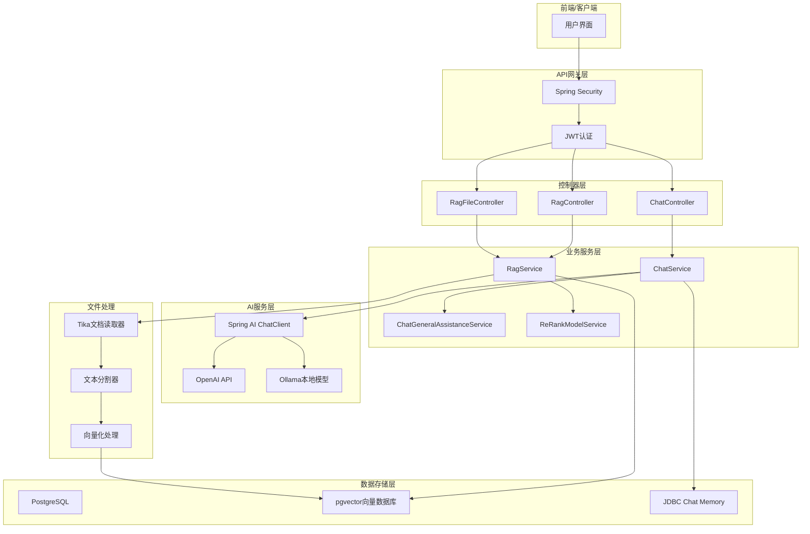
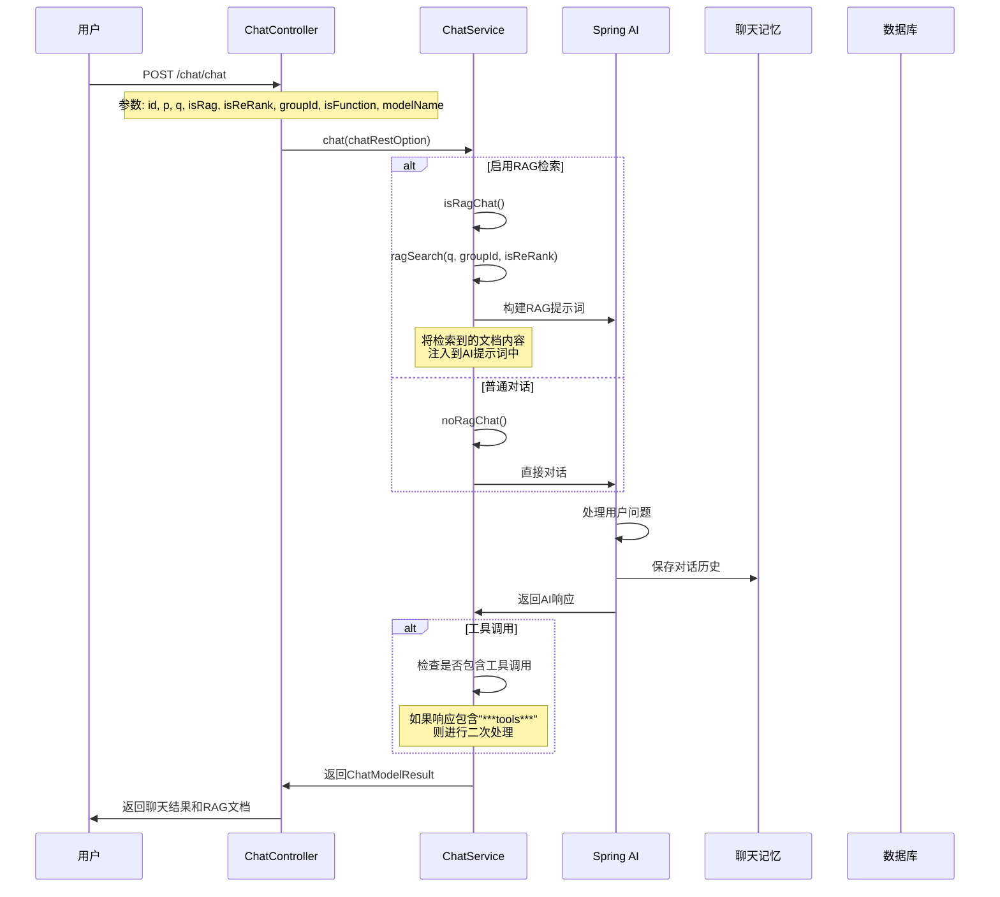
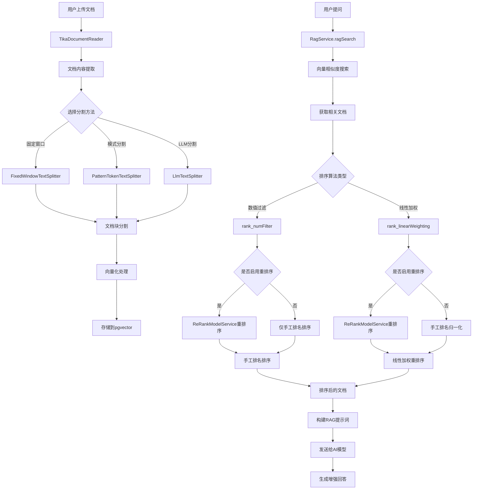
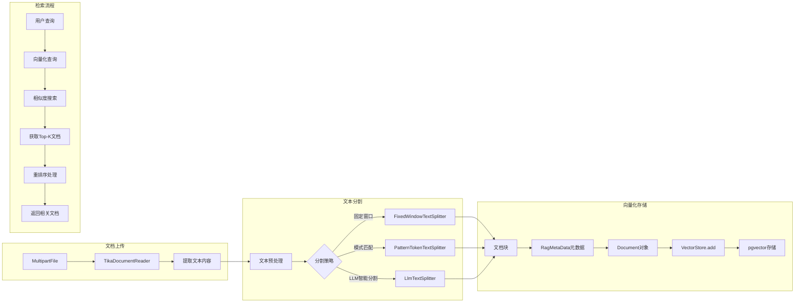
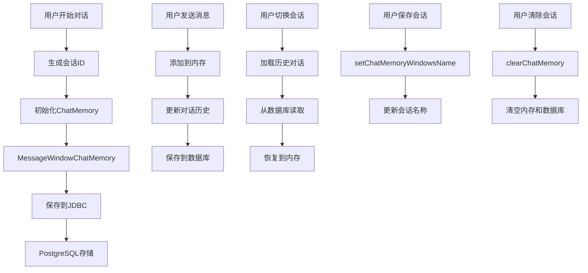
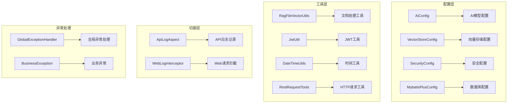
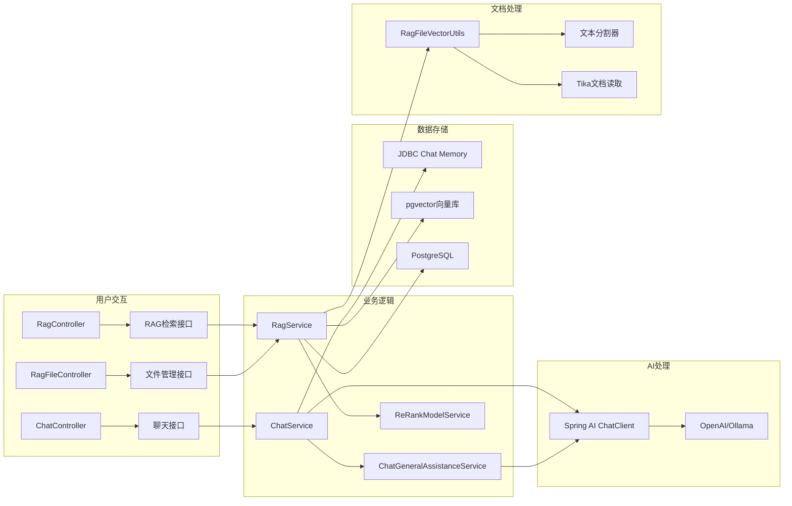
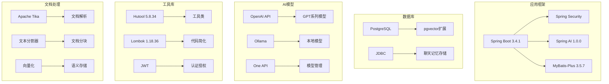

# 功能框架图

## 系统整体架构

## AI对话处理流程

## RAG检索增强生成流程

## 文档处理详细流程

## 聊天记忆管理

## 系统配置架构

## 核心功能模块关系

## 技术栈架构

## 关键特性说明

### 1. AI对话特性
- **多模型支持**: 支持OpenAI API和Ollama本地模型
- **聊天记忆**: 基于JDBC的持久化聊天历史
- **工具调用**: 支持AI工具调用和二次处理
- **会话管理**: 支持多会话切换和命名

### 2. RAG检索特性
- **文档处理**: 支持多种格式文档上传和解析
- **智能分割**: 多种文本分割策略（固定窗口、模式匹配、LLM分割）
- **向量存储**: 基于pgvector的高效向量检索
- **重排序**: 支持线性加权和数值过滤重排序
- **元数据管理**: 完整的文档元数据跟踪

### 3. 系统特性
- **安全认证**: JWT基于Spring Security的认证授权
- **API日志**: 完整的API调用日志记录
- **异常处理**: 全局异常处理和业务异常管理
- **配置管理**: 灵活的配置管理和环境适配 