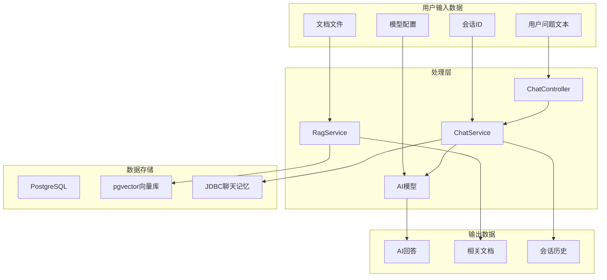
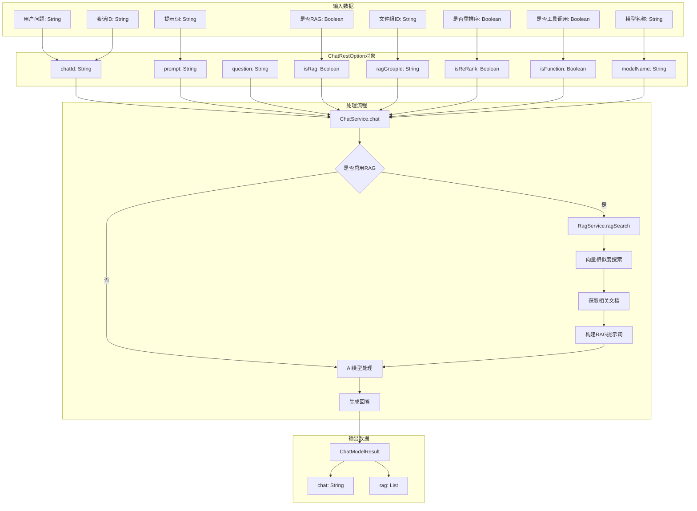
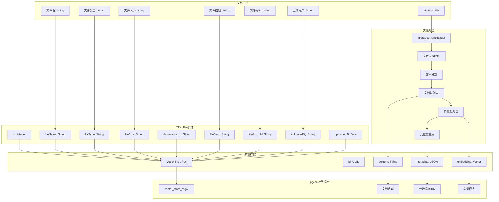
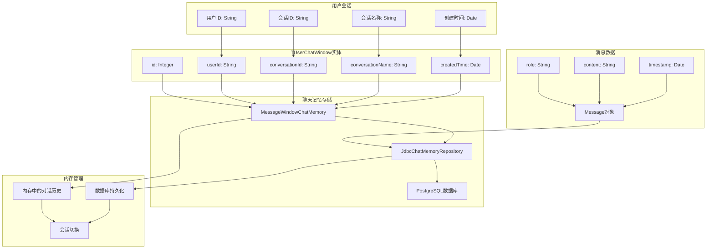
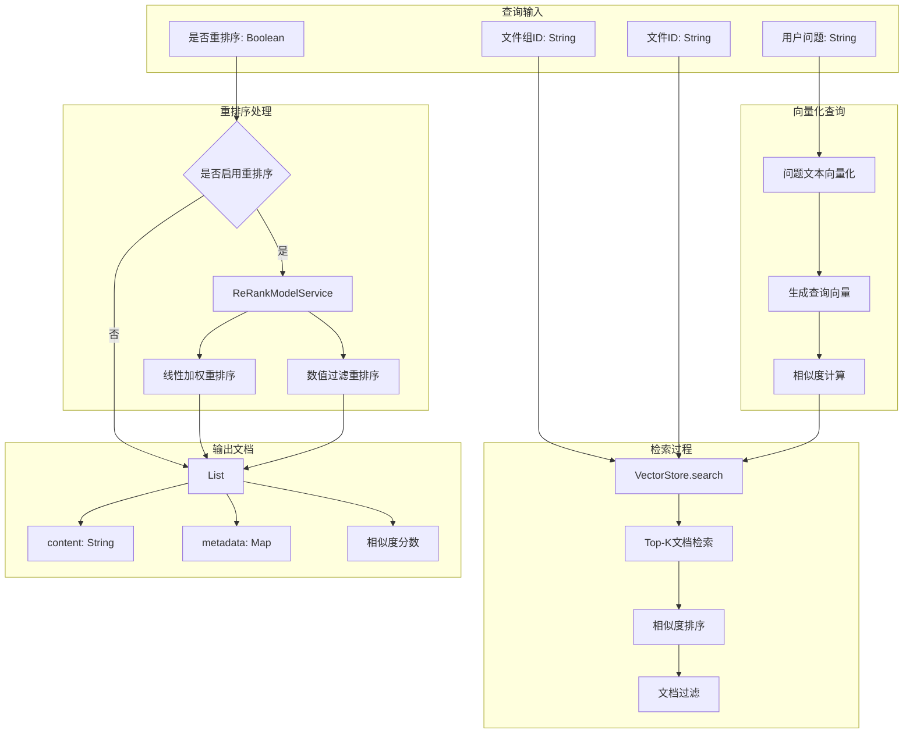
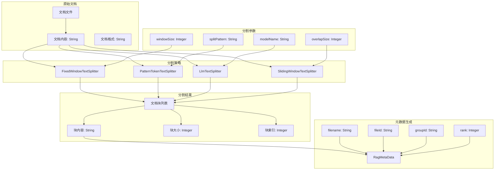
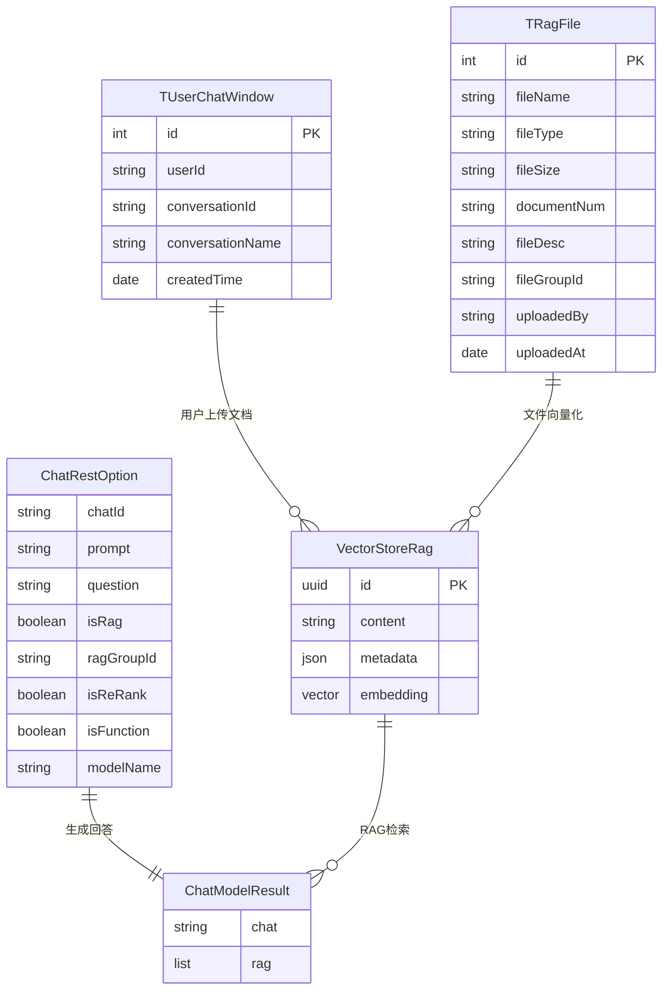
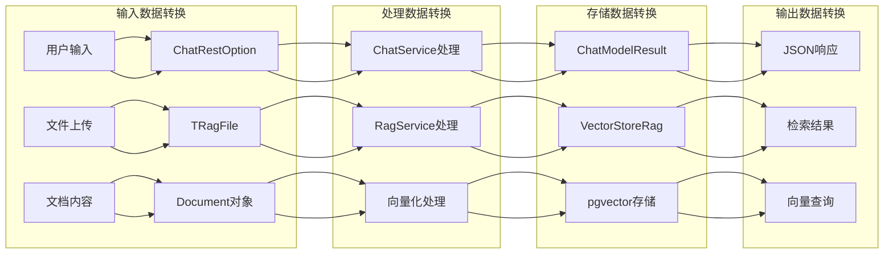

# 数据流程图

## 系统数据流概览

## AI对话数据流

## RAG文档处理数据流

## 聊天记忆数据流

## 向量检索数据流

## 文档分割数据流

## 数据实体关系图

## 数据转换流程

## 关键数据流说明

### 1. AI对话数据流
- **输入数据**: 用户问题、会话ID、模型配置等
- **处理流程**: ChatRestOption → ChatService → AI模型
- **输出数据**: ChatModelResult包含AI回答和相关文档

### 2. RAG文档处理数据流
- **文档上传**: MultipartFile → TRagFile实体
- **文档处理**: Tika读取 → 文本分割 → 向量化
- **向量存储**: Document → VectorStoreRag → pgvector

### 3. 聊天记忆数据流
- **会话管理**: TUserChatWindow存储会话信息
- **消息存储**: Message对象 → JDBC → PostgreSQL
- **记忆管理**: 内存缓存 + 数据库持久化

### 4. 向量检索数据流
- **查询处理**: 问题向量化 → 相似度搜索 → 重排序
- **结果输出**: List<Document>包含内容和元数据

### 5. 数据实体关系
- **用户会话**: TUserChatWindow管理用户对话
- **文件管理**: TRagFile管理上传的文档
- **向量存储**: VectorStoreRag存储文档向量
- **对话结果**: ChatModelResult封装AI回答

### 6. 数据转换特点
- **类型安全**: 使用强类型实体类
- **JSON序列化**: 元数据使用JSON格式
- **向量存储**: 使用pgvector扩展存储向量
- **分页查询**: 支持大数据量的分页处理 